# OmniPizza — QA Testing Platform

OmniPizza is a multi-platform, test-friendly food ordering sandbox designed for practicing UI + API automation (web + mobile) with deterministic chaos users and multi-market pricing.  
Users now select market directly on the **login** screen (web + mobile) before entering the app.

## Live Deployments (Render)

- **Web:** https://omnipizza-frontend.onrender.com
- **API:** https://omnipizza-backend.onrender.com

---

## Mobile App Releases

Pre-built binaries are published as GitHub Releases via the `Build Mobile Apps` workflow (manual dispatch).

| Platform | Artifact | How to install |
|----------|----------|---------------|
| **Android** | `omnipizza-release.apk` | `adb install omnipizza-release.apk` |
| **Android (test)** | `omnipizza-debug-androidTest.apk` | For instrumented test runners (Appium) |
| **iOS Simulator** | `OmniPizza-Simulator.zip` → `OmniPizza.app` | `xcrun simctl install booted OmniPizza.app` |

**[→ Download latest release](https://github.com/gsanchezm/OmniPizza/releases/latest)**  
All releases: https://github.com/gsanchezm/OmniPizza/releases

> The iOS build targets the simulator only (`iphonesimulator` SDK). It cannot be installed on a physical device without a distribution certificate.

---

## Screenshots

### Desktop

<table>
  <tr>
    <td align="center"><strong>Login</strong></td>
    <td align="center"><strong>Catalog</strong></td>
    <td align="center"><strong>Pizza Customizer</strong></td>
  </tr>
  <tr>
    <td>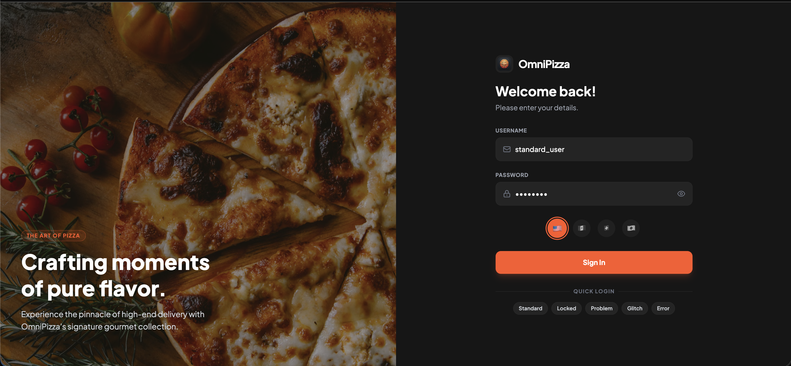</td>
    <td>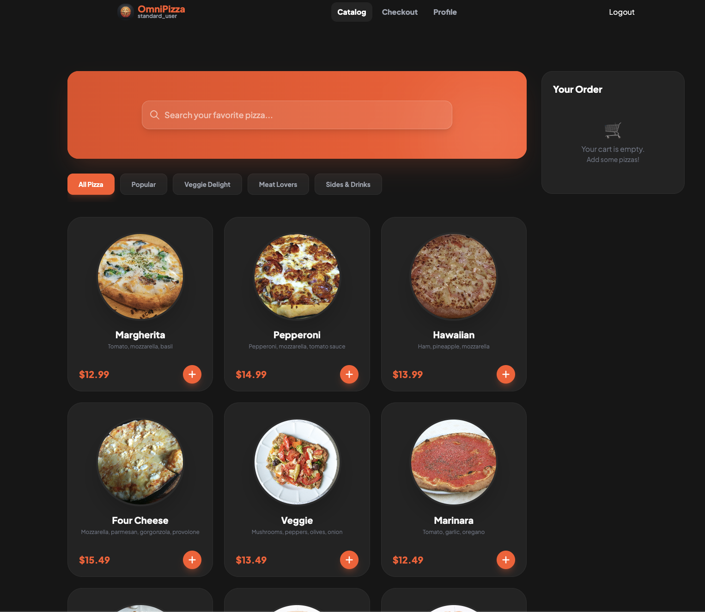</td>
    <td>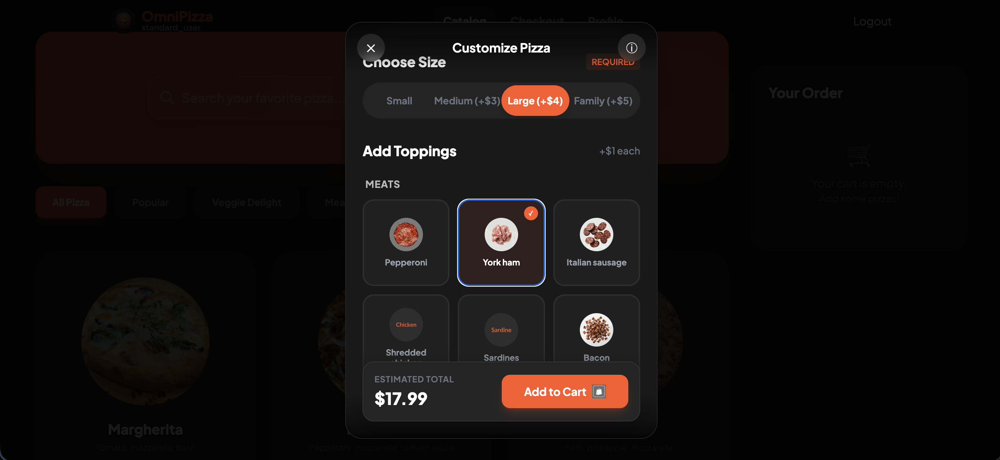</td>
  </tr>
  <tr>
    <td align="center"><strong>Checkout</strong></td>
    <td align="center"><strong>Order Success</strong></td>
    <td></td>
  </tr>
  <tr>
    <td>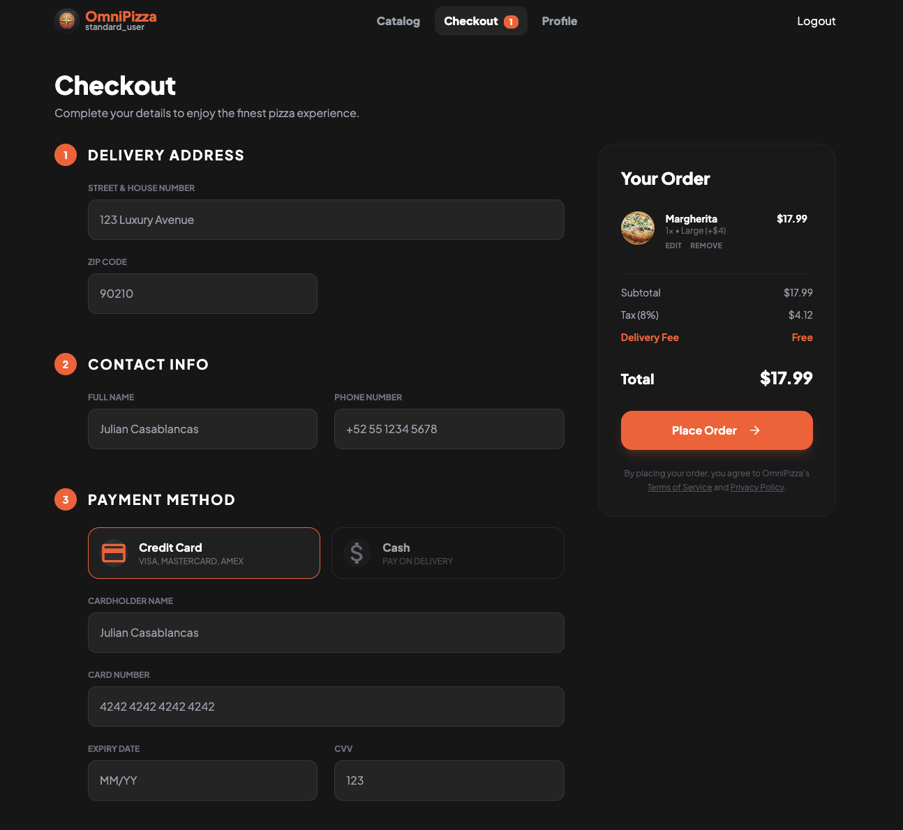</td>
    <td>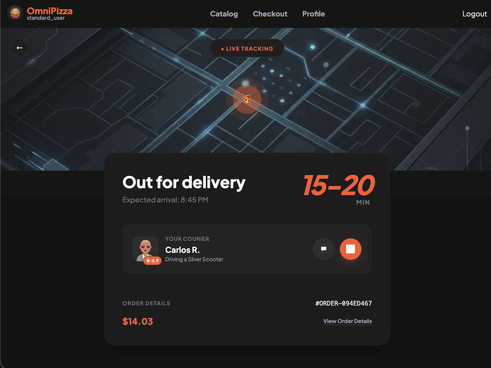</td>
    <td></td>
  </tr>
</table>

### Responsive (Mobile Web)

<table>
  <tr>
    <td align="center"><strong>Login</strong></td>
    <td align="center"><strong>Catalog</strong></td>
    <td align="center"><strong>Pizza Customizer</strong></td>
    <td align="center"><strong>Checkout</strong></td>
    <td align="center"><strong>Order Success</strong></td>
  </tr>
  <tr>
    <td>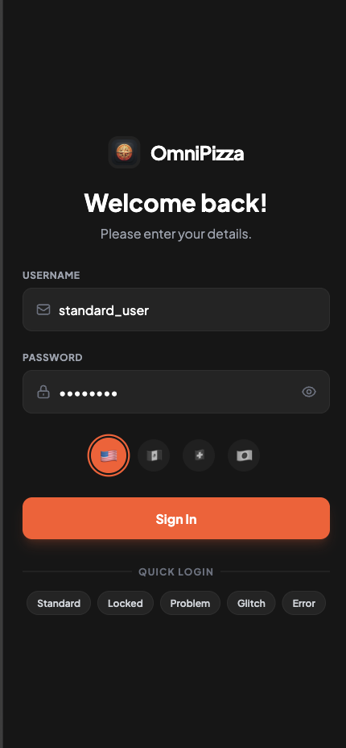</td>
    <td>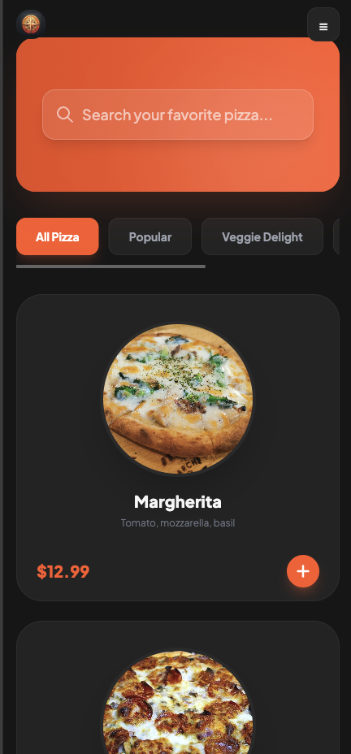</td>
    <td>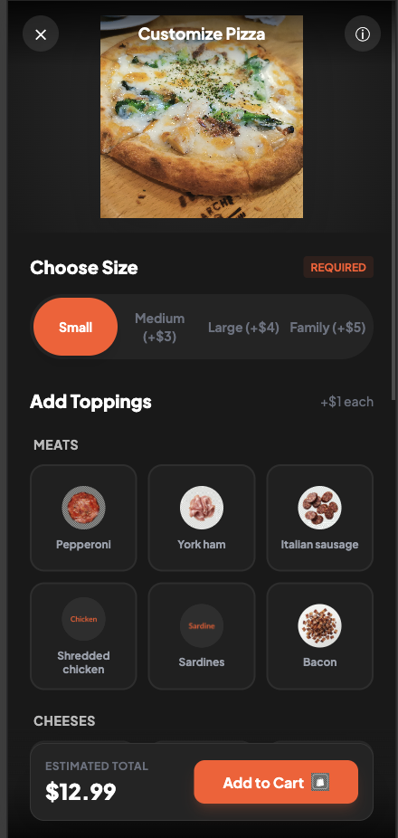</td>
    <td>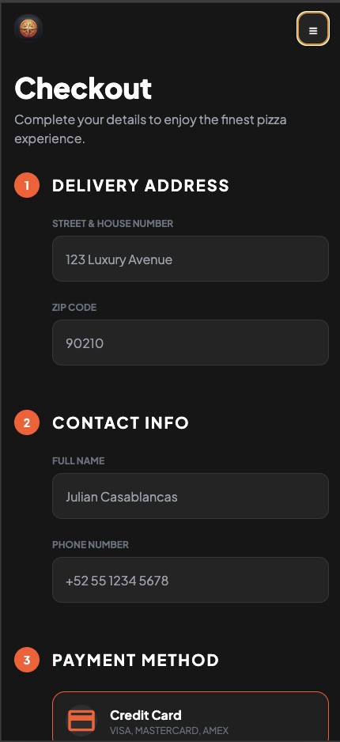</td>
    <td>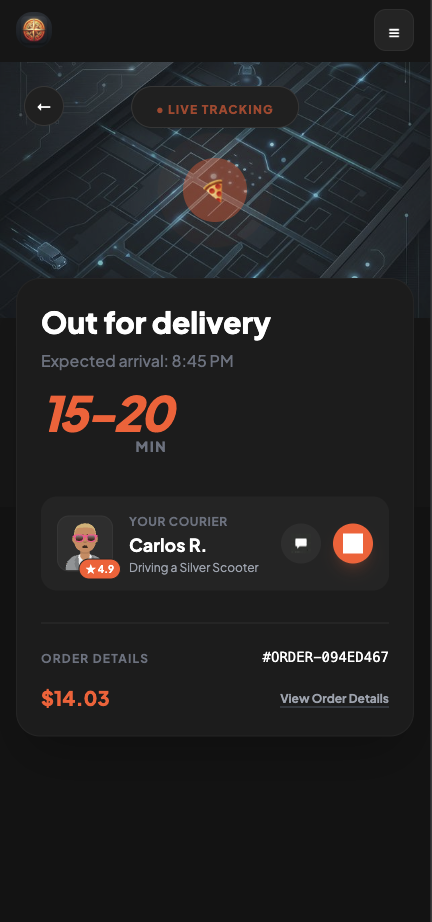</td>
  </tr>
</table>

### iOS (React Native)

<table>
  <tr>
    <td align="center"><strong>Login</strong></td>
    <td align="center"><strong>Catalog</strong></td>
    <td align="center"><strong>Pizza Builder</strong></td>
    <td align="center"><strong>Checkout</strong></td>
    <td align="center"><strong>Order Success</strong></td>
  </tr>
  <tr>
    <td>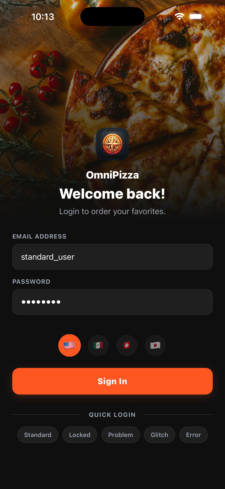</td>
    <td>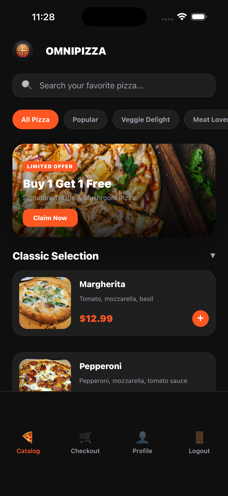</td>
    <td>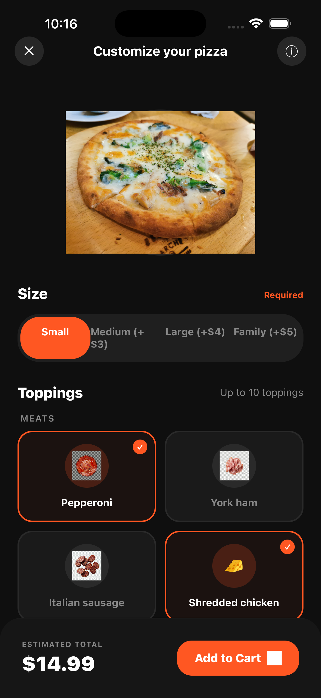</td>
    <td>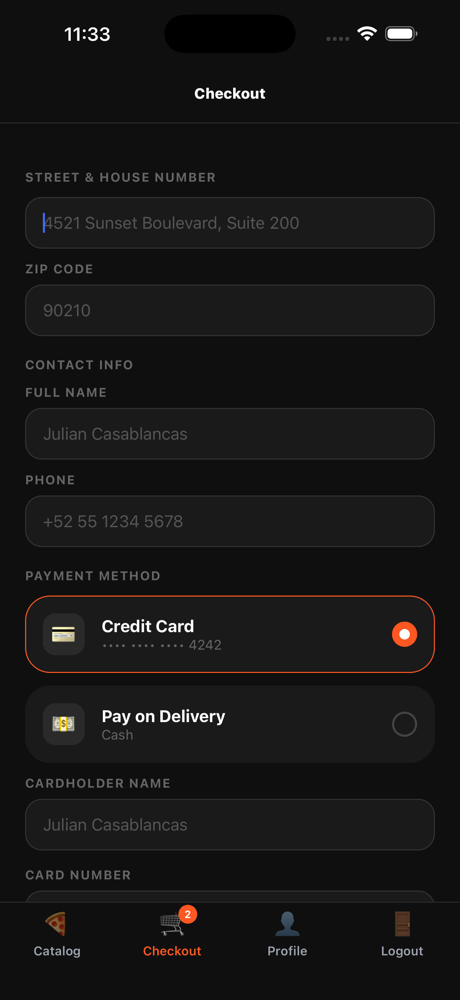</td>
    <td>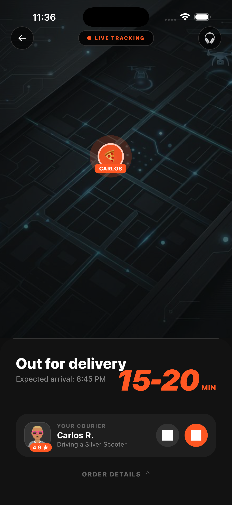</td>
  </tr>
</table>

---

## API Documentation (Swagger)

The backend exposes full OpenAPI documentation using **Swagger UI** and **ReDoc**.

### Swagger UI

Interactive documentation to explore and test endpoints.

- **Render:** https://omnipizza-backend.onrender.com/api/docs
- **Local:** http://localhost:8000/api/docs

### ReDoc

Clean, readable API reference.

- **Render:** https://omnipizza-backend.onrender.com/api/redoc
- **Local:** http://localhost:8000/api/redoc

### OpenAPI JSON

Raw OpenAPI specification (useful for contract testing tools).

- **Render:** https://omnipizza-backend.onrender.com/api/openapi.json
- **Local:** http://localhost:8000/api/openapi.json

### Required Headers (important)

Most endpoints rely on request headers to simulate multi-market behavior:

- `X-Country-Code: MX | US | CH | JP`
- `X-Language: en | es | de | fr | ja`
- `Authorization: Bearer <token>` (after login)

These headers are automatically sent by the **Web** and **Mobile** clients.

### Session Setup Endpoints

Atomic state setup endpoints exist for external automation runners (Playwright/Appium/Gatling).

- `POST /api/store/market`
- `POST /api/cart` — seed cart items (pizza_id, quantity, size)
- `GET /api/cart` — retrieve enriched cart (joined with pizza catalog: name, price, image, currency)
- `POST /api/session/reset`
- `GET /api/session`

Access rules:

- Require:
  - `Authorization: Bearer <token>`
  - `X-Country-Code` header (for `GET /api/cart` to resolve pricing/currency)

These endpoints reuse the same JWT generated by `/api/auth/login`.

### Cart Hydration (API State Injection)

Both web and mobile checkout screens automatically fetch `GET /api/cart` on load. This enables E2E test frameworks to inject cart state via the API:

1. Login via `POST /api/auth/login` to get a token
2. Seed cart via `POST /api/cart` with items (pizza_id, quantity, size)
3. Navigate the browser/app to the checkout screen
4. The frontend fetches `GET /api/cart` and hydrates the cart from backend state

If the backend cart is empty or the request fails, the frontend falls back to the existing client-side cart.

---

## What’s inside

### Test Users (deterministic behaviors)

| Username                | Password | Behavior                     |
| ----------------------- | -------- | ---------------------------- |
| standard_user           | pizza123 | Normal flow                  |
| locked_out_user         | pizza123 | Login fails (deterministic)  |
| problem_user            | pizza123 | $0 prices + broken images    |
| performance_glitch_user | pizza123 | API delay (~3s)              |
| error_user              | pizza123 | Random checkout error (~50%) |

### Markets (pricing + required fields)

| Market | Currency | Required fields | Optional fields | Notes                     |
| ------ | -------- | --------------- | --------------- | ------------------------- |
| MX     | MXN      | `colonia`       | `zip_code`, `propina` | Tip optional      |
| US     | USD      | `zip_code`      | —               | Tax applied               |
| CH     | CHF      | `plz`           | —               | **Language toggle DE/FR** |
| JP     | JPY      | `prefectura`    | —               | No decimals               |

### Language behavior

- The app **starts in English** (web + mobile).
- The selected market at login sets the default UI language:
  - **MX → Spanish (es)**
  - **US → English (en)**
  - **CH → German (de)** (with toggle to **French (fr)**)
  - **JP → Japanese (ja)**
- After login, market is no longer changeable from app navigation.

### Payment (UI simulation)

Checkout supports two selectable payment methods:

- **Credit Card** — Displays a full card form (Cardholder Name, Card Number, Expiry, CVV). Card details are **UI-only** and are **not sent** to the backend.
- **Cash on Delivery** — Hides the card form; order is placed without card details.

The payment method toggle uses `data-testid="payment-card"` and `data-testid="payment-cash"` for automation.

### Profile (Delivery Details)

The **Profile** page stores delivery details (name/address/phone) and **auto-fills Checkout**.

### Order Success

After checkout, the **Order Success** screen is shown and the last order remains accessible (web persists it via local storage).

### Mobile UX updates

- Navbar includes a **logout** button.
- Checkout validates required fields before submit (country-specific + inline errors).
- Layouts are rotation-ready (portrait/landscape) for iOS and Android.

### Mobile Deep Links (`omnipizza://`)

The app supports deep linking via the `omnipizza://` scheme, enabling external automation frameworks to open any screen directly after seeding state through the API — without executing the full user journey.

| Deep Link | Opens |
|-----------|-------|
| `omnipizza://login` | Login screen |
| `omnipizza://catalog` | Catalog screen |
| `omnipizza://pizza-builder?pizzaId=<id>&size=<size>` | Pizza Builder with pizza pre-loaded |
| `omnipizza://checkout?hydrateCart=true` | Checkout, hydrated from API cart |
| `omnipizza://order-success?orderId=<id>` | Order Success screen |
| `omnipizza://profile` | Profile screen |

Universal params supported on all routes: `market` (US/MX/CH/JP), `lang` (en/es/de/fr/ja), `resetSession=true`, `accessToken=<jwt>` (injects auth token, bypasses login UI).

See [ATOMIC_MOBILE_TESTING.md](./ATOMIC_MOBILE_TESTING.md) for the full reference and automation integration guide.

### Web visual assets

- Public icons/logos were standardized from `frontend-mobile/assets/icon.png`.
- Login page uses `frontend/public/login-bg-gradient.png` as the background.

---

## Project structure

```
OmniPizza/
├── backend/                # FastAPI backend + Swagger/OpenAPI
├── frontend/               # React + Vite web app
├── frontend-mobile/        # Expo / React Native app
├── tests/                  # API integration tests (Vitest)
├── docs/                   # Build/release notes
├── ordersuccess_ios/       # Product, design, and tech docs
└── screenshots/            # Reference UI captures
```

## Architecture

Both clients are being organized around feature slices instead of only technical folders.

- `frontend/src/features/*`
- `frontend-mobile/src/features/*`

Current slices include `auth`, `catalog`, `checkout`, `country`, `profile`, and `orderSuccess`.

The pattern used in both web and mobile is:

- repository layer for API access
- use-case layer for orchestration / payload building / validation
- UI pages and screens consuming those feature modules

Compatibility wrappers still exist in a few older hook paths so migration can remain incremental.

## Project Documentation

Current supporting docs live here:

- [ATOMIC_WEB_TESTING.md](./ATOMIC_WEB_TESTING.md) — web atomic test entry via localStorage injection + API cart hydration (Playwright guide)
- [ATOMIC_MOBILE_TESTING.md](./ATOMIC_MOBILE_TESTING.md) — mobile deep link support, atomic test entry, external automation guide
- [documents/Product_Requirement_Doc.md](./documents/Product_Requirement_Doc.md) — full product requirements, API contract map, validation rules, negative flows
- [documents/Tech_Stack_Doc.md](./documents/Tech_Stack_Doc.md) — technology decisions, deep link config, testing ecosystem
- [documents/Design_Doc.md](./documents/Design_Doc.md) — architecture and UX notes
- [documents/UI_Design_Doc.md](./documents/UI_Design_Doc.md) — visual system
- [docs/app-built.md](./docs/app-built.md) — mobile release/build pipeline

---

## Run locally

### Backend

```bash
cd backend
python3 -m venv venv
source venv/bin/activate  # Windows: venv\Scripts\activate
pip install -r requirements.txt
python3 main.py
```

- Swagger: http://localhost:8000/api/docs

### Web

```bash
cd frontend
pnpm install
pnpm dev
```

> The web client reads `VITE_API_URL` when provided, otherwise defaults to `http://localhost:8000`.
> On macOS/Linux you can run:
> `VITE_API_URL=http://localhost:8000 pnpm dev`

### Mobile

```bash
cd frontend-mobile
pnpm install
pnpm ios      # or pnpm android
```

> **Configuration:**
>
> - Mobile is configured to use the **Render API** (`https://omnipizza-backend.onrender.com`) strictly, with **mock data fallback removed**.
> - **Real Authentication:** Uses `/api/auth/login` to obtain valid JWT tokens.
> - **Market selection at login:** user picks market on the login screen (flag selector).
> - **Localization:** Full i18n support for Profile, Checkout, and Navbar.
> - **Error Handling:** Includes UI for connection retries.
> - **Orientation:** `frontend-mobile/app.json` uses `"orientation": "default"` for device rotation.

> To run against local backend, change `API_ORIGIN` in `frontend-mobile/src/api/client.ts`.

---

## Testing

### API Tests (Vitest)

The `tests/` directory contains automated API integration tests written in **TypeScript** with **Vitest**.

```bash
cd tests
pnpm install
pnpm test           # Run all tests
pnpm test:watch     # Watch mode
pnpm test:ui        # Interactive UI
```

Requires the backend running on `http://localhost:8000` (or set `API_BASE_URL`).

**Test suites:** Auth login, Pizza catalog, Checkout validation, Locked-out user, E2E standard flow, Country-specific logic (MX/US/CH/JP), Debug endpoints.

> Legacy Python contract tests (Schemathesis) are also available — see `tests/README.md`.

### Web Component Tests (Cypress)

The web app includes Cypress Component Testing for shared UI components.

```bash
cd frontend
pnpm install
pnpm test:ct
pnpm test:ct:open
```

Current component specs live in `frontend/cypress/component/`.

### CI Workflows

- [frontend-component-tests.yml](/Users/gilbertosanchez/Documents/Repos/OmniPizza/.github/workflows/frontend-component-tests.yml)
  Runs Cypress component tests on pull requests touching `frontend/**`. It is currently non-blocking (`continue-on-error: true`).
- [mobile-release.yml](/Users/gilbertosanchez/Documents/Repos/OmniPizza/.github/workflows/mobile-release.yml)
  Builds Android and iOS simulator artifacts through manual dispatch.

---

## Automation notes

- `/api/pizzas` requires `X-Country-Code` header for market pricing.
- Use the test users to validate reliability and chaos behaviors.
- All interactive elements have `data-testid` attributes for stable selectors.
- Checkout form fields are dynamic per market — ensure automation handles conditional rendering.
- Phone input uses `type="tel"` with pattern validation (`7-20 digits/spaces/+/-`).
- **Cart state injection:** Use `POST /api/cart` to seed cart items, then navigate to checkout — the frontend auto-hydrates from `GET /api/cart`. This skips the manual catalog-to-cart UI flow in E2E tests.
- **Web atomic entry:** Navigate directly to any route (`/checkout`, `/catalog`, `/profile`, `/order-success`) after injecting the auth token into `localStorage` via `page.addInitScript()`. The Checkout page fetches `GET /api/cart` automatically when the local cart is empty. See [ATOMIC_WEB_TESTING.md](./ATOMIC_WEB_TESTING.md).
- **Mobile atomic entry via deep links:** Use `omnipizza://` deep links to open the mobile app directly on any screen after API hydration. Pass `accessToken=<jwt>` to bypass the login UI entirely. Example: `omnipizza://checkout?market=MX&lang=es&hydrateCart=true&accessToken=eyJ...`. See [ATOMIC_MOBILE_TESTING.md](./ATOMIC_MOBILE_TESTING.md).

---

## License

MIT
